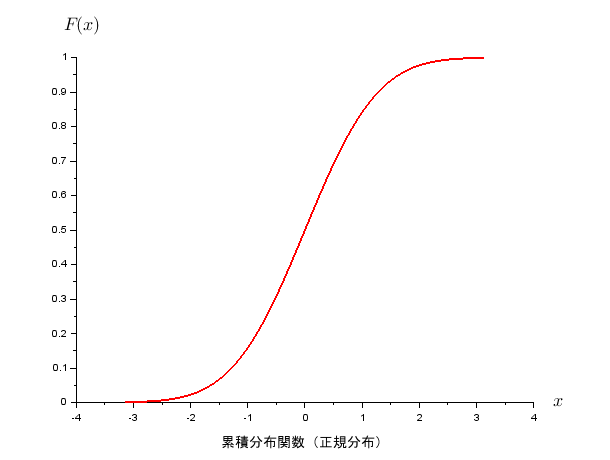

This is my collection of Scilab plot images.

****


```c
function fn=poipdf(u,x)
    fn=zeros(x);
    for i=1:length(x),
        val=x(i)
        fn(i) = ((u^val)/factorial(val))*exp(-u);
    end
endfunction

n=14;
clf();
X=0:n;
plot2d(X,poipdf(1.0,X),style=1);
plot2d(X,poipdf(2.5,X),style=2);
plot2d(X,poipdf(5.0,X),style=5);
xstring(1.2, 0.35, "$\mu=1.0$");
gce().font_size = 3;
xstring(2.2, 0.25, "$\mu=2.5$");
gce().font_size = 3;
xstring(5.5, 0.16, "$\mu=5.0$");
gce().font_size = 3;
```

****


```c
n=20;
clf();
plot2d(0:n, binomial(0.1,n), style=1);
plot2d(0:n, binomial(0.3,n), style=2);
plot2d(0:n, binomial(0.5,n), style=3);
plot2d(0:n, binomial(0.7,n), style=5);
//legends(["$p=0.1$";"$p=0.3$";"$p=0.5$";"$p=0.7$"], [1,2,3,5],opt="ur");
//xset("font", -1, 3);
xstring(2.5, 0.25, "$p=0.1$");
gce().font_size = 3;
xstring(6, 0.2, "$p=0.3$");
gce().font_size = 3;
xstring(10, 0.18, "$p=0.5$");
gce().font_size = 3;
xstring(15, 0.18, "$p=0.7$");
gce().font_size = 3;
```

****


```c
clf();
p=1/6;
n=10;
s=20;
B=binomial(p,n);
B=[B,zeros(1:10)];
plot2d(0:s, B, style=1);
s=20;
n=20;
plot2d(0:s, binomial(p,n), style=2);
n=30;
B=binomial(p,n);
B(:,21:30)=[]
plot2d(0:s, B, style=6);
n=50;
B=binomial(p,n);
B(:,21:50)=[]
plot2d(0:s, B, style=5);
xstring(2.5, 0.25, "$n=10$");
gce().font_size = 3;
xstring(4.2, 0.2, "$n=20$");
gce().font_size = 3;
xstring(6.4, 0.17, "$n=30$");
gce().font_size = 3;
xstring(10, 0.14, "$n=50$");
gce().font_size = 3;
```

****


```c
clf();
p=1/5;
n=5;
B=binomial(p,n);
B=B*n;
s=linspace(0,1,n+1)
plot(s, B, 'k--');
n=10;
B=binomial(p,n);
B=B*n;
s=linspace(0,1,n+1)
plot2d(s, B, style=1);
n=20;
B=binomial(p,n);
B=B*n;
s=linspace(0,1,n+1)
plot2d(s, B, style=2);
n=30;
B=binomial(p,n);
B=B*n;
s=linspace(0,1,n+1)
plot2d(s, B, style=6);
n=50;
B=binomial(p,n);
B=B*n;
s=linspace(0,1,n+1)
plot2d(s, B, style=5);
legend(["$n=5$","$n=10$","$n=20$","$n=30$","$n=50$"],opt="ur");
gce().font_size = 3;
```

****


```c
X=1:6;
Y=ones(1,6)./6;
clf();
plot2d3(X,Y,style=[5,3],rect=[0,0,6.5,1],nax=[0,-1,0,-1],axesflag=0);
a=gca();
a.margins=[0.125,0.125,0.125,0.15];
a.font_size = 3;
e=gce();
c=e.children;
c.line_style=3;
c.thickness=1;
//c.clip_state="off";
//c.mark_size=1;
//c.mark_style=0;
//c.mark_foreground=5;
plot2d(X,Y,style=[-9,3],axesflag=0);
e=gce();
c=e.children;
c.mark_foreground=5;
c.mark_background=5;
drawaxis(x=[0,7,0,7],y=0,dir='d',tics='i',sub_int=0);
drawaxis(y=[0,1/6,0,1],x=0,dir='l',tics='v',val=['0','$\frac{1}{6}$','','1.0'],sub_int=0);
xlabel("$x$","fontsize", 4, "position", [7.2,-0.02]);
ylabel("$f(x)$","fontsize", 4, "rotation", 360, "position", [-0.2,1.05]);
xtitle("確率密度関数（一様分布）");
t=a.title;
t.font_size=3;
t.position=[2,-0.2];
```

****


```c
X=0:6;
Y=0:1/6:1;
Z=X+1;
clf();
plot2d([X;Z],[Y;Y],axesflag=0);
a=gca();
a.margins=[0.125,0.125,0.125,0.15];
a.font_size = 3;
e=gce();
c=e.children;
//c.line_style=3;
c.thickness=2;
c.foreground=5;
//c.mark_style=0;
//c.mark_size=0;
//c.mark_foreground=5;
//c.mark_background=5;
//c.clip_state="off";
//drawaxis(x=0:7,y=0,dir='d',tics='v');
drawaxis(x=[0,7,0,7],y=0,dir='d',tics='i',sub_int=0);
drawaxis(y=[0,1,0,6],x=0,dir='l',tics='i',sub_int=0);
xlabel("$x$","fontsize", 4, "position", [7.25,-0.025]);
ylabel("$F(x)$","fontsize", 4, "rotation", 360, "position", [-0.3,1.05]);
xtitle("累積分布関数（一様分布）");
t=a.title;
t.font_size=3;
t.position=[2,-0.2];
```

****


```c
function fn=geocdf(p,x)
    fn=zeros(x);
    for i=1:length(x),
        val=x(i)
        fn(i) = 1-(1-p)^val;
    end
endfunction

n=200;
clf();
X=0:n;
plot2d(X,geocdf(0.001,X),style=1);
plot2d(X,geocdf(0.005,X),style=2);
plot2d(X,geocdf(0.01,X),style=5);
plot2d(X,geocdf(0.03,X),style=6);
plot2d(X,geocdf(0.05,X),style=3);
legend(["$p=0.1\%$","$p=0.5\%$","$p=1\%$","$p=3\%$","$p=5\%$"],-1);
gce().font_size = 2;
xgrid(color("gray"));
```

****


```c
//--------------------------------------------------
function fn=step(t,a)
    fn=bool2s((t-a)>=0);
endfunction

function fn=pulse(t,a,b)
    fn=step(t,a)-step(t,b);
endfunction

function fn=pdf(x,l)
    fn=l*exp(-l*x);
endfunction
//--------------------------------------------------
X=linspace(0,10,200);
Y=pdf(X,.5);
clf();
//plot2d2(X,Y,style=[5,3],rect=[-1.5,0,1.5,1],nax=[0,-1,0,-1]);
plot2d(X,Y,style=2,nax=[0,-1,0,-1]);
gce().children.thickness=2;
a=gca();
//a.margins=[0.125,0.125,0.125,0.15];
a.font_size = 3;

Y=pdf(X,1)
plot2d(X,Y,style=5);
gce().children.thickness=2;

Y=pdf(X,2)
plot2d(X,Y,style=3)
gce().children.thickness=2;
//--------------------------------------------------
legend(["$\lambda=0.5$","$\lambda=1$","$\lambda=2$"],1);
//--------------------------------------------------
xgrid(color("gray"));
xlabel("$x$","fontsize", 4, "position", [10.5,-0.02]);
ylabel("$f(x)$","fontsize", 4, "rotation", 360, "position", [-0.5,2.1]);
//xtitle("確率密度関数");
//t=a.title;
//t.font_size=3;
//t.position=[2,-0.2];
```

****


```c
//--------------------------------------------------
function fn=step(t,a)
    fn=bool2s((t-a)>=0);
endfunction

function fn=pulse(t,a,b)
    fn=step(t,a)-step(t,b);
endfunction

function fn=cdf(X,l)
    fn=1-exp(-l*X);
endfunction
//--------------------------------------------------
X=linspace(0,10,200);
Y=min(cdf(X,0.5),1);
clf();
//plot2d(X,Y,rect=[-1.4,0,1.4,1.2],nax=[0,-1,0,-1]);
plot2d(X,Y,style=2,nax=[0,-1,0,-1]);
a=gca();
//a.margins=[0.125,0.125,0.125,0.15];
a.font_size = 3;
gce().children.thickness=2;

Y=min(cdf(X,1),1);
plot2d(X,Y,style=5,nax=[0,-1,0,-1]);
gce().children.thickness=2;

Y=min(cdf(X,2),1);
plot2d(X,Y,style=3,nax=[0,-1,0,-1]);
gce().children.thickness=2;
//--------------------------------------------------
legend(["$\lambda=0.5$","$\lambda=1$","$\lambda=2$"],4);
//--------------------------------------------------
xgrid(color("gray"));
xlabel("$x$","fontsize", 4, "position", [10.5,-0.025]);
ylabel("$F(x)$","fontsize", 4, "rotation", 360, "position", [-0.5,1.05]);
//xtitle("累積分布関数");
//t=a.title;
//t.font_size=3;
//t.position=[2,-0.2];
```

****


```c
clf();
M=0;
S=1;
X=linspace(-4,4,100);
Y=exp(-0.5*X.^2);
plot2d(X,Y,style=5);
Y=exp(-1*X.^2);
plot2d(X,Y,style=2);
Y=exp(-2*X.^2);
plot2d(X,Y,style=6);
legend(["$a=0.5$","$a=1$","$a=2$"],1);
gce().font_size=3;
//xgrid(color("gray"));
```

****


```c
function fn=normpdf(M,S,x)
    fn=(1/(sqrt(2*%pi)*S))*exp(-(x-M)^2/(2*S*S));
endfunction

clf();
X=linspace(-4.5,4.5,200);
Y=normpdf(0,sqrt(0.5),X);
plot2d(X,Y,style=5);
Y=normpdf(0,sqrt(1),X);
plot2d(X,Y,style=2);
Y=normpdf(0,sqrt(2),X);
plot2d(X,Y,style=6);
legend(["$\sigma^2=0.5$","$\sigma^2=1$","$\sigma^2=2$"],1);
gce().font_size=3;
//xgrid(color("gray"));
```

****


```c
clf();
X=linspace(-%pi,%pi,100);
Y=exp(-0.5*X.^2);
xset("color",31);
xfpoly(X,Y);
plot2d(X,Y,style=21);
xset("color",0);
```

****


```c
[x,y]=meshgrid(-2.8:.15:2.8, -2.8:.15:2.8);
z=exp(-(x.^2+y.^2));
g=scf();
g.color_map=jetcolormap(64);
surf(x,y,z);
```

****


```c
// normal distribution
function fn=pdf(x,M,S)
    V=S*S;
    fn=exp(-(x-M)^2/(2*V))/(sqrt(%pi*2)*S);
endfunction

Mean=0;
Std=1;
//x=linspace(-%pi,%pi,100);
x=linspace(-5,5,200);
clf();
plot2d(x,pdf(x,Mean,Std),style=5,rect=[-5,0,5,0.5]);
//a=gca();
//a.thickness=2;
e=gce();
c=e.children;
c.thickness=2;
xlabel("$x$","fontsize", 4, "position", [5.25,-0.01]);
ylabel("$f(x)$","fontsize", 4, "rotation", 360, "position", [-5.3,0.52]);
xtitle("確率密度関数（正規分布）");
a=gca();
t=a.title;
t.font_size=3;
t.position=[-1.5,-0.08];
```

****



```c
// normal distribution
//function pr=normdist(z)
//    pr=integrate('exp(-x^2/2)/sqrt(%pi*2)','x',0,z);
//endfunction

//X=linspace(-%pi,%pi,100);
//Y=normdist(X);
//clf();
//plot2d(X,Y);

x=linspace(-%pi,%pi,100);
Mean=0;
Std=1;
P=cdfnor("PQ",x,Mean*ones(x),Std*ones(x));
clf();
plot2d(x,P,style=5);
e=gce();
c=e.children;
c.thickness=2;
xlabel("$x$","fontsize", 4, "position", [4.25,-0.025]);
ylabel("$F(x)$","fontsize", 4, "rotation", 360, "position", [-4.3,1.05]);
xtitle("累積分布関数（正規分布）");
a=gca();
t=a.title;
t.font_size=3;
t.position=[-1.5,-0.15];
```

****


```c
x = linspace(0, 2*%pi, 20);
y = sin(x);
plot2d(x,y);
```

****


```c
function fn=step(t,a)
    fn=bool2s((t-a)>=0);
endfunction

function fn=pulse(t,a,b)
    fn=step(t,a)-step(t,b);
endfunction

function fn=pdf(x)
    fn=pulse(x,-1,1)*0.5
endfunction
        
X=linspace(-1.5,1.5,200);
Y=pdf(X);
clf();
plot2d2(X,Y,style=[5,3],rect=[-1.5,0,1.5,1],nax=[0,-1,0,-1]);
xgrid(color("gray"));
a=gca();
//a.margins=[0.125,0.125,0.125,0.15];
a.font_size = 3;
e=gce();
c=e.children;
c.thickness=2;
//c.clip_state="off";
//c.mark_size=1;
//c.mark_style=0;
//c.mark_foreground=5;
xlabel("$x$","fontsize", 4, "position", [1.7,-0.02]);
ylabel("$f(x)$","fontsize", 4, "rotation", 360, "position", [-1.7,1.05]);
//xtitle("確率密度関数");
//t=a.title;
//t.font_size=3;
//t.position=[2,-0.2];
```

****


```c
function fn=step(t,a)
    fn=bool2s((t-a)>=0);
endfunction

function fn=pulse(t,a,b)
    fn=step(t,a)-step(t,b);
endfunction

function fn=cdf(X)
    fn=(X+1)*0.5;
endfunction

X=linspace(-1.5,1.5,200);
//Y=cdf(X).*pulse(X,-1,1);
Y=min(cdf(X).*step(X,-1),1);
clf();
plot2d(X,Y,rect=[-1.4,0,1.4,1.2],nax=[0,-1,0,-1]);
xgrid(color("gray"));
a=gca();
//a.margins=[0.125,0.125,0.125,0.15];
a.font_size = 3;
e=gce();
c=e.children;
//c.line_style=3;
c.thickness=2;
c.foreground=5;
//c.mark_style=0;
//c.mark_size=0;
//c.mark_foreground=5;
//c.mark_background=5;
//c.clip_state="off";
//drawaxis(x=0:7,y=0,dir='d',tics='v');
xlabel("$x$","fontsize", 4, "position", [1.5,-0.025]);
ylabel("$F(x)$","fontsize", 4, "rotation", 360, "position", [-1.5,1.25]);
//xtitle("累積分布関数");
//t=a.title;
//t.font_size=3;
//t.position=[2,-0.2];
```

****


```c
N=100;
A=3;
B=2;
R=round(grand(1,N,"bet",A,B)*100);
M=mean(R);
S=stdev(R);
mprintf("mean=%f(%f) stdev=%f(%f)", M, round(M), S, round(S));
X=linspace(0,100,11);
clf();
histplot(X,R,style=2);
//[cf,ind] = histc(X,R);
//disp(cf,ind);
```

****


```c
n=10000;
x=bool2s(rand(1,n)<0.5);
y=cumsum(x)./(1:n);
plot(y);
a=gca();
a.data_bounds(:,2)=[0.4,0.6];
```

****


```c
t=rand(2,500);
x=cos(2*%pi*t(1,:)) .* sqrt(t(2,:));
y=sin(2*%pi*t(1,:)) .* sqrt(t(2,:));
z=sqrt(1-t(2,:));
scatter3(x,y,z,"fill");
scf();
subplot(1,3,1);
    histplot(10,x,1);
    xlabel("x");
subplot(1,3,2);
    histplot(10,y);
    xlabel("y");
subplot(1,3,3);
    histplot(10,z);
    xlabel("z");
```

****


```c
function y = d_beckmann(alpha,theta_m)
    M = alpha*alpha;
    t = cos(theta_m);
    T = t .* t;
    t = max(t,0);
    //y=(1/(%pi*M*T*T))*%e^(-tan(theta_m)^2/M);
    //y=(1/(%pi*M*T*T))*%e^((T-1)/(M*T));
    y=(%e^((T-1)./(M*T)))./(%pi*M*T.*T);
endfunction

function y = d_phong(alpha,theta_m)
    T = cos(theta_m);
    t = max(T,0);
    d = ((alpha+2)/(2*%pi));
    y = d*T.*(T^alpha);
endfunction

function y = d_ggx(alpha,theta_m)
    M = alpha*alpha;
    Cos = cos(theta_m);
    CosSqr = Cos^2;
    CosSqrSqr = CosSqr^2;
    TanSqr = (1-CosSqr)./CosSqr;
    //y = (1/%pi)*((M*CosSqr)./(CosSqrSqr.*(M+TanSqr)^2));
    y = (1/%pi)*(((alpha*Cos)./(CosSqr.*(M+TanSqr)))^2);
endfunction

n=90;
x=linspace(-%pi/4,%pi/4,n);
y=d_beckmann(0.2,x);
plot(x,y,"b");
y=d_phong(48,x);
plot(x,y,"g")
y=d_ggx(0.2,x);
plot(x,y,"r");
a=gca();
a.box="off";
a.y_location="middle";
legend(["beckmann","phong","ggx"],-1);
title('$\text{Microfacet Distribution Function} \quad (\alpha_{b}=0.2,\alpha_{p}=48,\alpha_{g}=0.2)$','fontsize',3);
```


